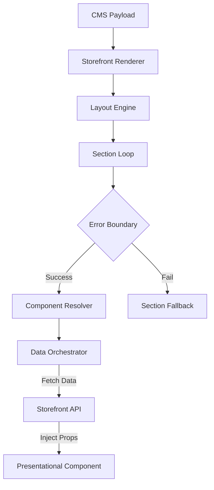

# CMS Rendering Engine: Architecture & Design

## **1. Architectural Vision**
The CMS Rendering Engine is a high-performance, schema-driven system that decouples **Content Definition** (Laravel CMS) from **Visual Representation** (Nuxt Storefront). It treats every page as a tree of sections and blocks, where the Nuxt runtime acts as a "dumb" orchestrator that injects data into **Presentational-Only** components.

---

## **2. System Components**

### **A. Section Rendering System**
The `StorefrontRenderer` is the entry point. It receives a JSON schema and recursively resolves sections.
- **Contract**: Every section must adhere to the `CmsSection` interface.
- **Orchestration**: It manages the transition between sections, ensuring layout consistency.

### **B. Component & Block Registry**
- **Component Registry**: A centralized map in `core/rendering/registry.ts` linking CMS types (e.g., `hero_2026`) to physical Vue files.
- **Block Registry**: Defines nested "Blocks" allowed within specific sections (e.g., `Slide` blocks inside a `Slider` section). This allows for deep nesting while maintaining strict schema validation.

### **C. Dynamic Layout Engine**
The runtime inspects the `layout` property of the CMS payload.
- **Switching**: Dynamically swaps the Nuxt Layout using `<NuxtLayout :name="payload.layout">`.
- **Theme Injection**: Applies merchant-specific CSS tokens (colors, fonts) at the root layout level.

---

## **3. Page Schema & Payload Structure**

### **Proposed CMS Payload Structure**
```json
{
  "version": "2026-05",
  "id": "page_home_01",
  "type": "standard_page",
  "layout": "default",
  "locale": "en",
  "seo": {
    "title": "Summer Collection 2026",
    "meta": [{ "name": "description", "content": "Explore our new arrivals" }],
    "og_image": "https://cdn.justshop.com/site/og.jpg"
  },
  "theme_overrides": {
    "primary_color": "#FF5733",
    "font_family": "Inter, sans-serif"
  },
  "sections": [
    {
      "id": "sec_1",
      "type": "featured_collection",
      "version": "v1",
      "data_source": {
        "type": "collection",
        "id": "summer_sale"
      },
      "settings": {
        "title": "New Summer Arrivals",
        "columns": 4,
        "lazy_load": true
      },
      "blocks": []
    }
  ]
}
```

---

## **4. Runtime Rendering Flow**

1.  **Route Match**: `[...slug].vue` captures the path.
2.  **Context Resolution**: Nitro identifies the `tenant_id` and `locale`.
3.  **Payload Fetch**: Nuxt calls the CMS API: `GET /api/v1/cms/resolve?path=/&tenant=123`.
4.  **Data Orchestration**: The engine parses `sections`. For any section with a `data_source`, the runtime initiates a parallel fetch (e.g., fetching products for a `featured_collection`).
5.  **Prop Injection**: Normalized data + `settings` are injected into the presentational component via `v-bind`.
6.  **SEO Update**: `useHead()` is called with the resolved metadata.

---

## **5. Hydration & Performance**

### **Async Section Loading**
- Sections marked as `lazy_load: true` in the schema are wrapped in `defineAsyncComponent`.
- The renderer uses an `IntersectionObserver` to trigger hydration/mounting only when the section enters the viewport.

### **Hydration Strategy**
- **Static Content**: Sections like `RichText` are rendered with `v-once` to prevent re-hydration overhead.
- **Interactive Content**: Sections like `CartDrawer` or `SearchOverlay` are hydrated immediately.

---

## **6. Advanced Rendering Features**

### **Error Isolation & Boundaries**
- Each section is wrapped in a `NuxtErrorBoundary`.
- **Fallback Rendering**: If a component fails or the type is missing from the registry, a `SectionFallback` component is rendered, preventing a total page crash.

### **Merchant Theme & Section Overrides**
- **Theme Overrides**: Global CSS variables injected at the `:root`.
- **Section Overrides**: Merchants can provide custom CSS snippets or Tailwind classes via `settings.custom_classes`, which the component applies to its wrapper.

### **Localization Strategy**
- The CMS payload is delivered already localized for the requested `locale`.
- The runtime handles RTL/LTR switching based on the `dir` property in the tenant context.

---

## **7. Data Ownership Matrix**

| Domain | Responsibilities |
| :--- | :--- |
| **Laravel CMS** | Page hierarchy, Section order, settings/content values, visibility rules (A/B tests). |
| **Nuxt Runtime** | Data fetching (Orchestration), Component mapping, SEO merging, Error handling. |
| **Themes** | **Presentational Components**, Design tokens (CSS variables), Animation definitions. |

---

## **8. Versioning Strategy**
- **Schema Versioning**: The payload includes a `version` string to ensure backward compatibility as the Page Builder evolves.
- **Component Versioning**: The registry supports versioned keys: `hero:v1` and `hero:v2`. This allows merchants to continue using old sections while new themes are rolled out.

---

## **9. Rendering Boundary Diagram**


