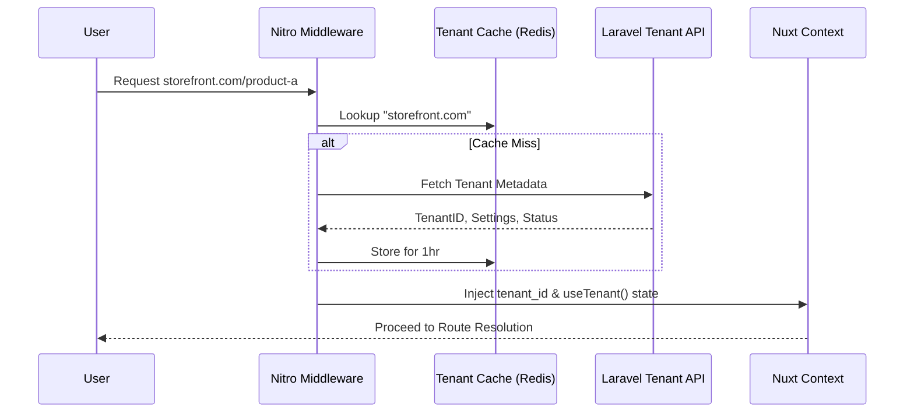
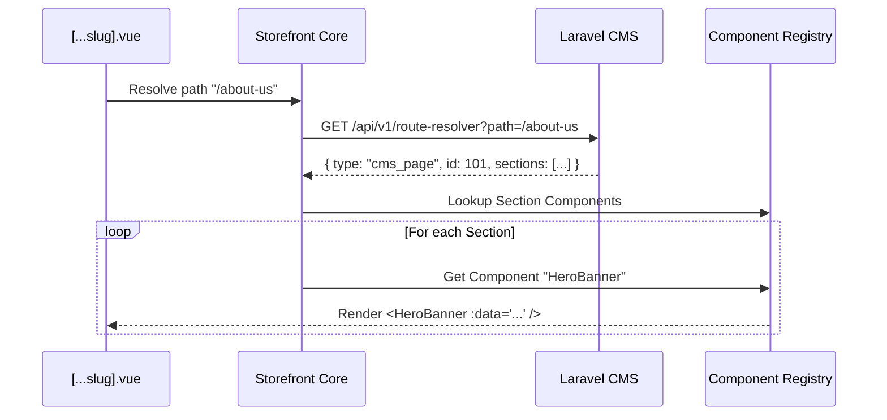

# Architecture Design: Storefront Core Platform

## **1. Purpose & Vision**

The `storefront-core` is the engine that transforms a static Nuxt application into a **multi-tenant storefront runtime**. It serves as the "Operating System" for storefronts, providing the essential services required to resolve, render, and optimize merchant-specific storefronts at runtime.

### **Primary Objectives**
- **Abstraction**: Decouple business domains (Catalog, Cart) from infrastructure concerns.
- **Tenant Isolation**: Ensure strict data and style boundaries between merchants.
- **Dynamic Orchestration**: Resolve routes and render pages based on remote CMS configurations rather than local files.
- **Extensibility**: Provide hooks and registries for future "Apps" and theme overrides.

---

## **2. Core Responsibilities & Boundaries**

### **What belongs inside `storefront-core`?**
- **Tenant Context**: Resolution and management of the current merchant's identity, settings, and domain.
- **Route Resolution**: Mapping incoming URLs to entities (Product, Category, CMS Page).
- **Orchestration Layer**: Normalized API client that handles tenant scoping and error transformation.
- **Rendering Engine**: The "Section Renderer" and "Layout Manager".
- **Global SEO & Meta Engine**: Centralized handling of meta tags and structured data.
- **Platform-level Cache**: Scoped caching strategies for SSR and client-side data.

### **What must NEVER belong inside `storefront-core`?**
- **UI Components**: Core defines *how* to render, but the components (Buttons, Cards) live in the UI/Theme layer.
- **Hardcoded Business Logic**: Specific pricing rules or discount calculations belong in the Backend or Domain layer.
- **Stripe/Payment SDKs**: These are integration concerns for the Checkout Domain.

---

## **3. Platform Lifecycles**

### **A. Tenant Context Lifecycle**
1.  **Resolution (Nitro)**: Incoming request hostname is mapped to a `tenant_id` via a high-performance lookup.
2.  **Injection**: `tenant_id` is injected into the H3 event and Nuxt context.
3.  **State Initialization**: Tenant settings (brand colors, feature flags) are loaded and provided via a global `useTenant()` composable.

### **B. Request & API Orchestration Lifecycle**
1.  **Scoping**: Every outgoing request to the backend is automatically tagged with `X-Tenant-Id`.
2.  **Normalization**: Raw backend responses are transformed into Core DTOs (Data Transfer Objects).
3.  **Error Handling**: Domain-agnostic error normalization (e.g., 404 mapping to a "Merchant Not Found" or "Page Not Found" template).

### **C. Rendering Lifecycle (The Pipeline)**
1.  **Path Resolution**: The `[...slug].vue` entry point queries the Route API.
2.  **Template Selection**: Core identifies the required Layout and Page Template.
3.  **Section Fetching**: Core fetches the list of sections/blocks for the resolved page.
4.  **Loop & Render**: The `SectionRenderer` iterates through the list, matching block names to the `ComponentRegistry`.

---

## **4. Proposed Folder Structure**

```text
src/core/
├── tenant/             # Tenant resolution, settings, and domain mapping
├── runtime/            # Route resolver, lifecycle hooks, and plugin orchestration
├── rendering/          # SectionRenderer, LayoutManager, and ComponentRegistry
├── api/                # Normalized fetcher, DTO transformers, and tenant scoping
├── seo/                # Meta tag engine, Sitemap generation, and Structured Data
├── cache/              # Tenant-aware cache keys and invalidation logic
└── error/              # Global error normalization and platform-level guards
```

---

## **5. Architectural Diagrams**

### **Tenant Resolution Flow (Sequence Diagram)**


### **Dynamic Rendering Pipeline**


---

## **6. Framework-Agnostic Boundaries**

The `storefront-core` is designed to be **Nuxt-centric but Logic-isolated**.
- **Nitro Ownership**: All "Inbound" logic (Tenant resolution, Request proxying) lives in Nitro server routes and middleware.
- **Composable Ownership**: All "Outbound" logic (API calls, SEO updates) is exposed via Core Composables (`useStorefrontApi`, `useTenantSEO`).
- **Middleware Ownership**: Core owns the `01.tenant.global.ts` middleware to ensure context is available before any domain logic executes.

---

## **7. SSR & Cache Lifecycle**

- **Tenant-Scoped Keys**: All `useAsyncData` keys follow the pattern: `tenant:${id}:domain:${name}:key:${path}`.
- **SSR Hydration**: Tenant settings are serialized into the Nuxt payload to prevent layout shifts during hydration.
- **Cache Invalidation**: The platform supports `X-Tenant-Purge` headers to clear merchant-specific caches without affecting the entire platform.

---

## **8. Localization & SEO Lifecycle**

- **i18n Sync**: The `storefront-core` ensures that the `tenant_id` and `locale` are always synchronized.
- **SEO Orchestration**: 
  - **Site Level**: Tenant settings provide the base `og:image`, `favicon`, and `title_template`.
  - **Entity Level**: The Route Resolver provides specific meta tags for the resolved product or page.
  - **Merge**: Core merges these levels, ensuring entity SEO always wins over site SEO.
