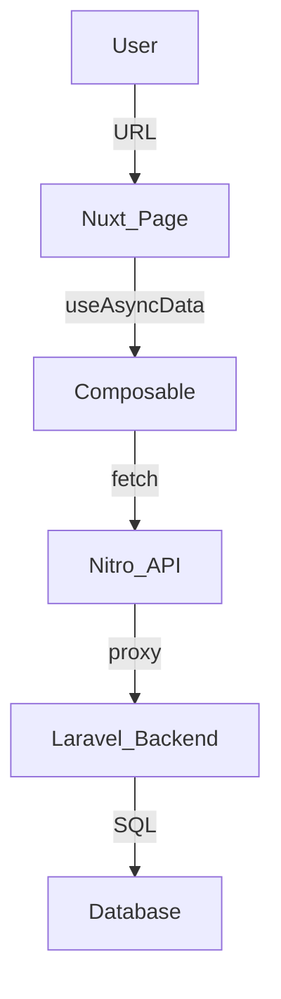

# Architecture Audit: Multi-Tenant Storefront Platform

## **Executive Summary**

This audit evaluates the current Nuxt 4 codebase for its readiness to transition from a single-storefront model to a multi-tenant storefront runtime platform. While the codebase follows modern Nuxt patterns and maintains a clean directory structure, significant architectural shifts are required to support multi-tenancy, dynamic rendering, and a merchant-managed theme system.

---

## **Current Architectural State**

### **Strengths**
- **Nuxt 4 / Vue 3 / TypeScript**: The foundation is modern and leverages the latest features (e.g., layers-ready structure).
- **Domain-Driven Component Organization**: Components are logically grouped by domain (auth, cart, product), facilitating future extraction into shared libraries or layers.
- **CSS Token System**: The use of CSS variables for colors and typography provides a solid starting point for a theme engine.
- **Centralized Routing**: `shared/utils/routes.ts` ensures consistency between frontend and backend proxy calls.
- **SSR Optimized**: Core data fetching (e.g., `HeroSection`, `ProductGrid`) uses `useAsyncData`, ensuring good SEO performance.

### **Weaknesses**
- **Zero Tenant Awareness**: The frontend has no mechanism to identify or switch between tenants (stores). Tenant ID/Domain resolution is missing from both client and server layers.
- **Static Route Architecture**: All pages are defined via file-based routing (e.g., `/products/category/[slug]`). This is incompatible with a merchant-managed CMS where URLs might be dynamic.
- **API Ownership Anti-Pattern**: Components fetch their own data (e.g., `HeroSection` calls `useHero`). In a platform model, page data should be orchestrated by a CMS layer to avoid over-fetching and enable layout customization.
- **Hardcoded Layouts**: Layouts like `default.vue` and `auth.vue` are static. A platform requires dynamic layout injection based on tenant configuration.

---

## **Platform Readiness Analysis**

| Category | Readiness | Severity | Risk |
| :--- | :--- | :--- | :--- |
| **Tenant Awareness** | 🔴 Critical Gap | High | Cache collisions between stores; data leakage risks. |
| **Dynamic Rendering** | 🔴 Missing | High | Impossible to support "Page Builder" features without code changes. |
| **Theme System** | 🟡 Partial | Medium | Static CSS variables cannot be overridden per-merchant at runtime. |
| **Route Architecture** | 🔴 Inflexible | High | Merchant-defined slugs (e.g., `/about-us`) cannot be resolved. |
| **API Proxy Layer** | 🟢 Ready | Low | Current Nitro server proxy is a good foundation for tenant injection. |

---

## **Severity & Risk Explanations**

### **1. Tenant Awareness (Severity: CRITICAL)**
- **Risk**: The current `useAsyncData` keys (e.g., `hero-banners-${locale}`) are only scoped by locale. In a multi-tenant environment, Store A's hero banner would be cached and potentially served to Store B's visitors.
- **Requirement**: Every API call and cache key must be scoped by a `tenant_id` or `domain`.

### **2. Route Resolution (Severity: HIGH)**
- **Risk**: Merchants expect to create custom pages. The current structure requires a developer to create a `.vue` file for every new page type.
- **Requirement**: Transition to a "Catch-all" route (`[...slug].vue`) that queries a CMS API to determine the component tree for a given path.

### **3. Component Coupling (Severity: MEDIUM)**
- **Risk**: Components like `HeroSection` are hardcoded to specific API endpoints.
- **Requirement**: Components should be "dumb" data consumers, receiving their props from a "Section Renderer" that handles data orchestration.

---

## **Architectural Diagrams**

### **Current Single-Tenant Flow**


### **Proposed Multi-Tenant Platform Flow**
```mermaid
graph TD
    User -->|URL| Tenant_Resolver[Tenant/Domain Resolver Middleware]
    Tenant_Resolver -->|inject tenant_id| CatchAll_Route[[...slug].vue]
    CatchAll_Route -->|query CMS| CMS_API[Laravel CMS Engine]
    CMS_API -->|return Section Map| CatchAll_Route
    CatchAll_Route -->|loop| Section_Renderer[Dynamic Section Renderer]
    Section_Renderer -->|render| UI_Blocks[Theme Blocks / Sections]
```

---

## **Migration Recommendations**

### **Phase 1: Foundation (Must Fix Now)**
1.  **Tenant Middleware**: Implement a Nitro middleware to resolve `tenant_id` from the request domain/header.
2.  **Scoping Headers**: Update `useServerApi` and `useApi` to automatically inject `X-Tenant-Id` into all requests.
3.  **Cache Scoping**: Update all `useAsyncData` keys to include the tenant identifier.
4.  **Dynamic Theme Injection**: Transform static CSS tokens into a `useThemeConfig` composable that injects merchant-specific variables into the document root.

### **Phase 2: Storefront Runtime (Next Steps)**
1.  **Catch-all Route**: Introduce a `[...slug].vue` handler to resolve merchant-managed pages.
2.  **Component Registry**: Create a map of "Block Names" to "Vue Components" to enable the CMS to drive the UI.
3.  **Layout Engine**: Abstract `Header` and `Footer` to accept configuration from the tenant context instead of being hardcoded.

### **Phase 3: Extensibility (Safe to Postpone)**
1.  **Merchant-specific CSS**: Support for uploading custom CSS files per tenant.
2.  **App System**: Architecture for injecting 3rd party scripts or components (Shopify-style Apps).

---

## **Technical Debt Hotspots**
- **`app/stores/cart.ts`**: Logic for merging guest/auth carts is complex and tightly coupled to specific API structures. Needs abstraction to support different cart "strategies".
- **`app/assets/css/`**: Style definitions are scattered. Recommend moving towards a utility-first or "headless UI" approach for core platform components to ensure theme flexibility.
- **`shared/utils/routes.ts`**: This file will grow exponentially. It should be split into `core-api`, `merchant-api`, and `storefront-api`.

---

## **Safe to Postpone vs. Must Fix Now**

| Task | Priority | Rationale |
| :--- | :--- | :--- |
| **Tenant-aware Cache Keys** | **MUST FIX NOW** | Prevents critical cross-tenant data leakage. |
| **X-Tenant-Id Headers** | **MUST FIX NOW** | Required for Laravel backend to identify the tenant context. |
| **Catch-all Routing** | **MUST FIX NOW** | Foundation for the CMS/Page Builder. |
| **Advanced Theme Editor** | Safe to Postpone | Merchants can use default themes initially. |
| **Marketing Page Templates** | Safe to Postpone | Can be added iteratively once the engine is ready. |
