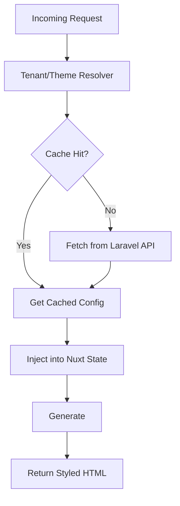

# Theme System Architecture: Multi-Tenant Storefront

## **1. Architectural Vision**
The Theme System is a dynamic, token-driven architecture designed to provide merchants with deep visual control while maintaining a unified, high-performance platform core. It treats "Themes" as swappable configurations that map business-level branding (colors, fonts, layouts) to technical CSS variables and component overrides.

---

## **2. Core Components**

### **A. Theme Runtime Architecture**
- **Resolution**: Occurs in the Nitro server layer. The runtime identifies the active theme and its configuration before rendering begins.
- **Injection**: Theme configurations are injected into the Nuxt context and serialized for client-side hydration.
- **Switching**: Supports real-time theme swapping for "Preview Mode" without requiring a full site rebuild.

### **B. Theme Configuration System**
Themes are defined by a manifest and a schema that dictates what merchants can customize.
- **Manifest**: Metadata (name, author, version, parent theme).
- **Schema**: Defines UI controls for the Admin Dashboard (e.g., color pickers, font selectors).
- **Settings**: The actual values chosen by the merchant, stored as JSON in the Laravel backend.

---

## **3. CSS Token Strategy & Injection**

### **Token Hierarchy**
1.  **Primitive Tokens**: Platform-wide constants (e.g., `--spacing-4`, `--z-index-modal`).
2.  **Semantic Tokens**: Mapped to merchant choices (e.g., `--color-primary`, `--font-heading`).
3.  **Component Tokens**: Localized overrides (e.g., `--button-bg`, `--header-height`).

### **Runtime Injection**
To prevent Flash of Unstyled Content (FOUC), the system uses **Server-Side CSS Injection**:
- Nitro generates a `<style id="theme-variables">` block during SSR.
- This block contains the `:root` variables derived from the merchant's settings.

---

## **4. Tenant Theme Resolution Flow**



---

## **5. Theme Inheritance & Overrides**

### **Inheritance Model**
- **Storefront-Core**: Base layouts and functional styles.
- **Base Theme**: The "Parent" theme (e.g., "Minimalist", "Bold").
- **Merchant Overrides**: Custom colors, fonts, and section settings.

### **Overrides Logic**
- **Layout Overrides**: Themes can specify which base layout to use (e.g., `theme-minimal/default.vue`).
- **Section Overrides**: Merchants can override specific section styles (e.g., "Add custom CSS to this Hero Banner").

---

## **6. Filesystem & Manifest Structure**

### **Proposed Filesystem**
```text
src/themes/
├── core/                # Platform-wide functional styles
├── theme-minimal/       # A specific theme package
│   ├── manifest.json    # Metadata & Versioning
│   ├── schema.json      # Customization controls definition
│   ├── assets/          # Theme-specific fonts/images
│   ├── layouts/         # Theme-specific layout overrides
│   └── tokens.css       # Default theme tokens
```

### **Theme Manifest (manifest.json)**
```json
{
  "id": "theme-justshop-classic",
  "version": "1.2.0",
  "author": "JustShop Core Team",
  "extends": "core-base",
  "supports": ["cms-v2", "apps-v1"]
}
```

---

## **7. Asset Ownership & Strategy**

| Asset Type | Ownership | Storage Strategy |
| :--- | :--- | :--- |
| **Platform Assets** | Core Team | Global CDN (Immutable) |
| **Theme Assets** | Theme Author | Theme Folder / Global CDN |
| **Merchant Assets** | Merchant | Tenant-specific CDN path |

---

## **8. Customization Boundaries**

### **What Merchants CAN Customize**
- **Brand Identity**: Colors, typography, logos.
- **Layout Selection**: Choosing between available theme layouts.
- **Section Settings**: Padding, alignment, background images.
- **Custom CSS**: Limited, sanitized CSS snippets for specific sections.

### **What Merchants MUST NEVER Control**
- **Core JS Logic**: Merchants cannot inject arbitrary JavaScript (Security/Performance).
- **DOM Structure**: Direct manipulation of the component templates (preserves platform stability).
- **Core Navigation Logic**: Auth flows, checkout redirects, and routing.

---

## **9. Performance & Security**

- **Isolation**: Themes are strictly presentational. They cannot access `process.env` or sensitive store data.
- **Compilation**: CSS variables are resolved at runtime, avoiding expensive PostCSS/Sass compilation for every tenant request.
- **Versioning**: Themes follow SemVer. When a merchant updates a theme, the platform validates compatibility with their current "Apps" and CMS version.
